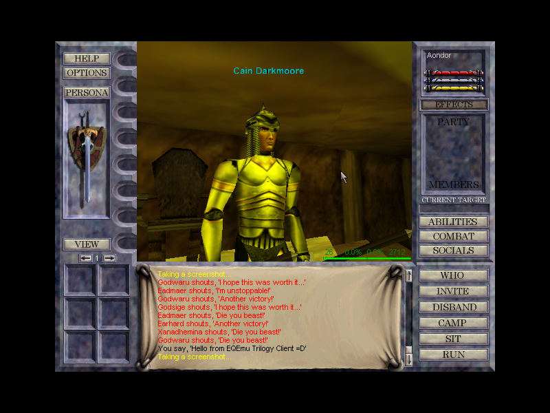
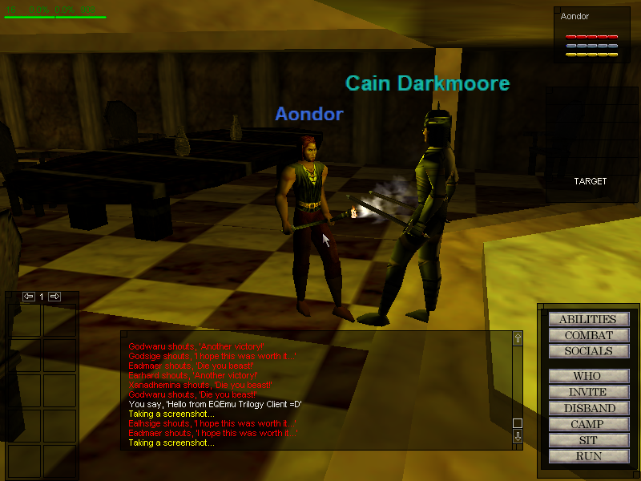
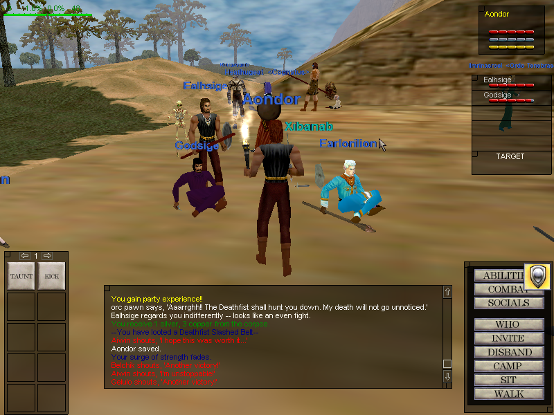
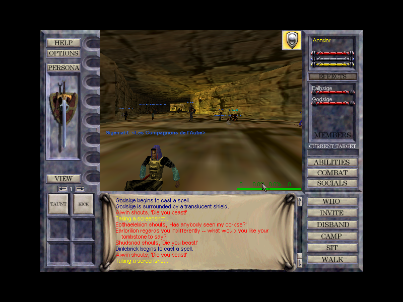
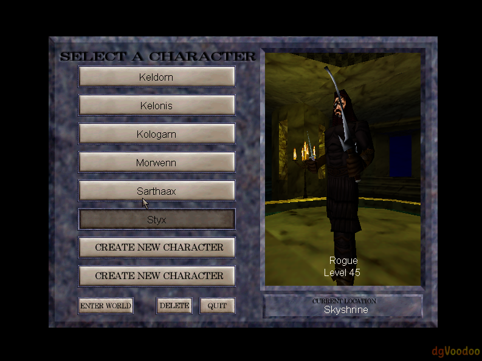
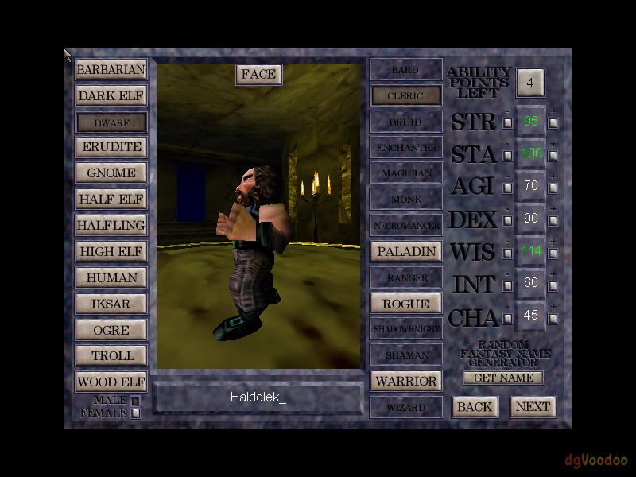

# EQEmulator Core Server
| Drone (Linux x64) | Drone (Windows x64)   |
|:---:|:---:|
|   |   |

***

**EQEmulator is a custom completely from-scratch open source server implementation for EverQuest built mostly on C++**
 * MySQL/MariaDB is used as the database engine (over 200+ tables)
 * Perl and LUA are both supported scripting languages for NPC/Player/Quest oriented events
 * Open source database (Project EQ) has content up to expansion OoW (included in server installs)
  * Game server environments and databases can be heavily customized to create all new experiences
 * Hundreds of Quests/events created and maintained by Project EQ

## Server Installs
| |Windows|Linux|
|:---:|:---:|:---:|
|**Install Count**||| 
### > Windows 

* [Install Guide](https://docs.eqemu.io/server/installation/server-installation-windows/)

### > Debian/Ubuntu/CentOS/Fedora

* [Install Guide](https://docs.eqemu.io/server/installation/server-installation-linux/)

* You can use curl or wget to kick off the installer (whichever your OS has)
> curl -O https://raw.githubusercontent.com/EQEmu/Server/master/utils/scripts/linux_installer/install.sh install.sh && chmod 755 install.sh && ./install.sh

> wget --no-check-certificate https://raw.githubusercontent.com/EQEmu/Server/master/utils/scripts/linux_installer/install.sh -O install.sh && chmod 755 install.sh && ./install.sh 

## Supported Clients

|Titanium Edition|Secrets of Faydwer|Seeds of Destruction|Underfoot|Rain of Fear|
|:---:|:---:|:---:|:---:|:---:|
||||||

**This fork additionally supports the original EverQuest _Trilogy_ client (v29c, build `8-09-2001 14:25`)** — a client that predates every officially-supported EQEmu client. See [Trilogy Client Support](#trilogy-client-support-this-fork) below.

## Trilogy Client Support (this fork)

This fork extends the upstream EQEmu server with support for the pre-Daybreak Verant Trilogy client (`v29c` / `v30`). All upstream client support (Titanium through RoF2) is preserved and continues to work alongside the Trilogy path — Trilogy players and modern-client players coexist in the same zones, groups, and raids.

### Screenshots

<em>Click any screenshot to view full size.</em>

|   |   |   |   |   |   |
|:---:|:---:|:---:|:---:|:---:|:---:|
|  |  |  |  |  |  |

**Highlights**
 - Full in-zone gameplay: movement, combat, spells (256-slot spellbook, 15 buffs), grouping/raids, merchants, banking, tradeskills/combines, doors, boats, corpses/loot, trades (PC↔PC and PC↔NPC), quests, and zone transitions.
 - Char select, character create, and world→zone handoff on the Verant login/world protocol.
 - Coexistence with modern clients (visibility, aggro, groups, raids, chat).
 - Bot integration (including Trilogy-aware `^botlist`, `^raidshow`, `^rosterlist`).

Note: this is still very much a **work in progress**, there will be bugs and stuff maybe not implemented.

**Architecture (short version)**
 - A standard EQEmu **patch translation layer** at [common/patches/trilogy*](common/patches/) handles struct/opcode translation (see the sibling `titanium.*` files for the template).
 - A bespoke **EQNetwork session layer** — `TrilogyLoginServer`, `TrilogyWorldServer`, `TrilogyZoneServer`, and `TrilogyClient` — speaks the pre-Daybreak Verant UDP protocol (SEQSTART / ARQ / ARSP / fragment reassembly / CRC). Raw datagrams the normal `EQStream` stack can't identify are routed into these handlers via `OnUnknownPacket`.
 - `TrilogyClient : public Client` plugs into the existing entity system, so `entity_list`, aggro/hate, groups/raids, and cross-client visibility all work unchanged.

**Where to read more**
 - [CLAUDE.md](CLAUDE.md) — architectural overview, the client-patch layer, the EQNetwork session layer, and the current list of Trilogy gotchas.
 - [trilogy_plan.md](trilogy_plan.md) — original field-by-field struct/opcode reference and protocol-difference table.

**Companion repositories (this fork)**
 - [proxeeus/VisualEQ](https://github.com/proxeeus/VisualEQ) — work-in-progress 3D zone editor for spawns, zonelines, grids, etc.
 - [proxeeus/quests](https://github.com/proxeeus/quests) — quest scripts (Perl/Lua) used with this server.
 - [proxeeus/lua_modules](https://github.com/proxeeus/lua_modules) — shared Lua modules loaded by quest scripts.
 - [proxeeus/plugins](https://github.com/proxeeus/plugins) — Perl quest plugins.
 - [proxeeus/eqemu_db](https://github.com/proxeeus/eqemu_db) — the associated database.

**Credits / references**
 - [EQClassic](https://github.com/EQClassic) — authoritative reference for opcodes, struct layouts, and the DES login key.
 - The upstream [EQEmu](https://github.com/EQEmu/Server) project, on top of which all of this is built.

## Bug Reports 
* Please use the [issue tracker](https://github.com/EQEmu/Server/issues) provided by GitHub to send us bug
reports or feature requests.
* The [EQEmu Forums](http://www.eqemulator.org/forums/) are also a place to submit and get help with bugs.

## Contributions 

* The preferred way to contribute is to fork the repo and submit a pull request on
GitHub. If you need help with your changes, you can always post on the forums or
try Discord. You can also post unified diffs (`git diff` should do the trick) on the
[Server Code Submissions](http://www.eqemulator.org/forums/forumdisplay.php?f=669)
forum, although pull requests will be much quicker and easier on all parties.

## Contact 

 - Discord Channel: https://discord.gg/QHsm7CD
 - **User Discord Channel**: `#general`
 - **Developer Discord Channel**: `#eqemucoders`

## Resources
- [EQEmulator Forums](http://www.eqemulator.org/forums)
- [EQEmulator Wiki](https://docs.eqemu.io/)

## Related Repositories
* [ProjectEQ Quests](https://github.com/ProjectEQ/projecteqquests)
* [Maps](https://github.com/Akkadius/EQEmuMaps)
* [Installer Resources](https://github.com/Akkadius/EQEmuInstall)
* [Zone Utilities](https://github.com/EQEmu/zone-utilities) - Various utilities and libraries for parsing, rendering and manipulating EQ Zone files.

## Other License Info

* The server code and utilities are released under **GPLv3**
* We also include some small libraries for convienence that may be under different licensing
  * SocketLib - GPL LibXML
  * zlib - zlib license
  * MariaDB/MySQL - GPL
  * GPL Perl - GPL / ActiveState (under the assumption that this is a free project)
  * CPPUnit - GLP StringUtilities - Apache
  * LUA - MIT

## Contributors

